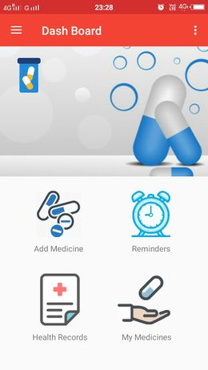
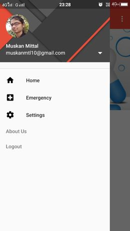
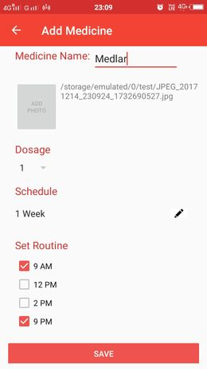
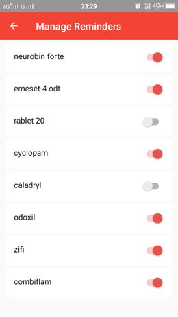
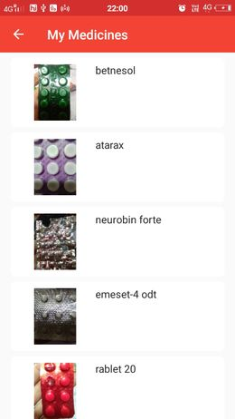
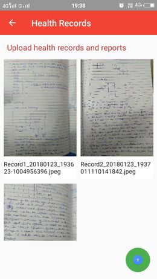

# Medical Help - No excuses for delays in taking medicines

This is an application targeting the aged population as a medical helper. The user or anyone on behalf of the user can enter the medicine reminders by specifying the name, quantity and when it should be taken as a reminder. The reminder helps the user to look into the details of tablets that he or she has to take.

## Features

* Set reminder notifications for any medicine by adding the medicine through the *Add Medicine* option available on the dashboard.
* Reminder can be updated by clicking on the particular medicine under the *My Medicines* option. Update the schedule or the routine as required.
* The alarm for a particular medicine can be enabled or disabled through *Reminders* option.
* Health reports and other medical documents can be stored through the *Health Records* option.
* Emergency call to the ambulance can be made through the app, feature available in the navigation drawer.
* User can change password for his account and manage reminders through the *Settings* option.

## Screenshots

&nbsp;&nbsp;&nbsp;  

&nbsp;&nbsp;&nbsp;    

&nbsp;&nbsp;&nbsp;    